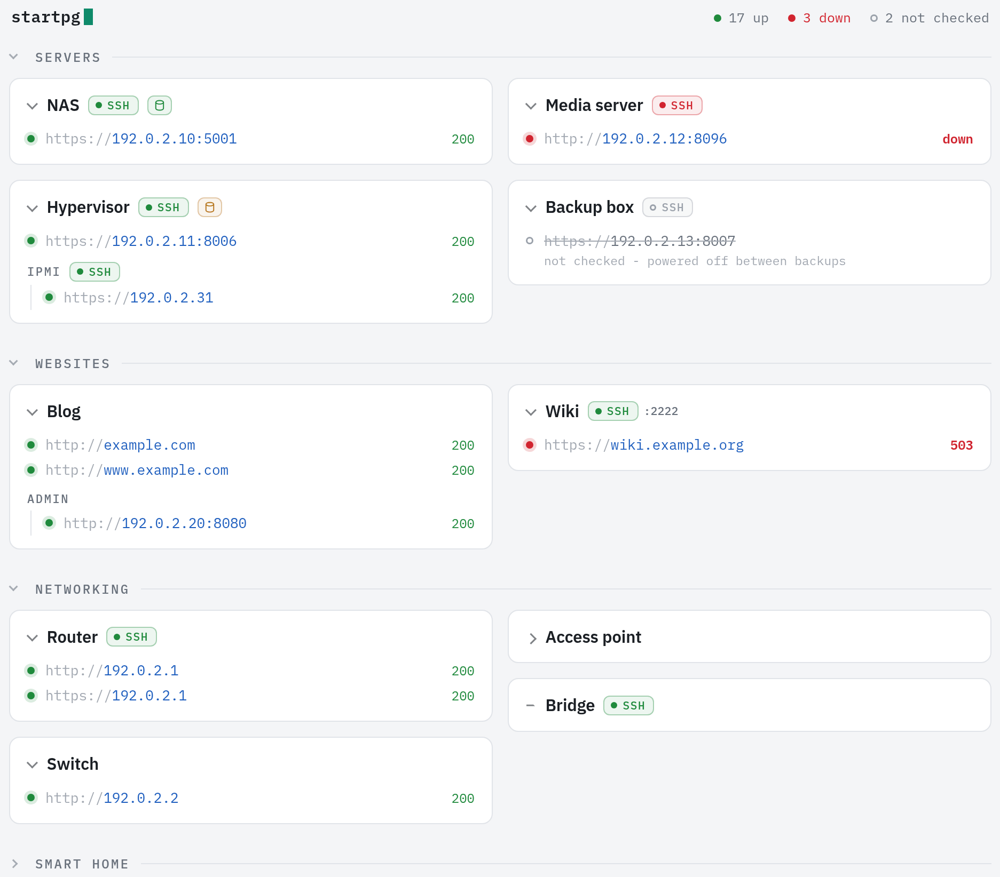

startpg
-------

Serve a personal homepage that shows the status of all your network services.  Checks whether the addresses are up from a small backend.

For use on your local network only, don't put this on the internet.

<picture>
  <source media="(prefers-color-scheme: dark)" srcset="docs/screenshot-dark.png">
  
</picture>


Prerequisites
-------------

I tested with the versions below, others may work:

- Debian 13
- python3.13
- uv 0.12.13

Quickstart
----------

After cloning this repo, set up your config:

```sh
mkdir config
cp startpg.example.yaml config/startpg.yaml
vi config/startpg.yaml
```

The example yaml shows you how to write your own, but if you wanted the smallest possible yaml that watched a single service it would look like this:

```yaml
Group:
  Site:
    services:
      - url: https://google.com
```

After editing your config:

```sh
uv v
. .venv/bin/activate
uv pip install -e .
./runface-debug
```

Pull up your browser and go to localhost:5000, you'll see question marks after the URLs - no status checks have been run yet.

`./runface-debug --lan` serves it to your whole local network instead, say to try it from your phone.

To run status checks, in another terminal:

```sh
cd $startpg_repo
uv run hiney
```

Go back to :5000 in your browser, refresh, and you'll see each site now has a status.

Architecture
------------

- face - Frontend (webserver) process
- torso - Lib shared between face and hiney
- hiney - Backend (monitor, daemon) process
- hands - Interactive tool that syncs startpg.yaml with an Opnsense router's DHCP reservations

Configuration
-------------

Your site's config lives in `config/`, which this repo ignores:

- `config/startpg.yaml` - the groups, hosts and services on the page. Start
  from `startpg.example.yaml`.
- `config/deploy.env` - `IP=<the VM's address>`, for `deploy-live`.

To keep the config versioned without publishing it, make `config/` a git repo
of its own, with a private remote. Nothing in it can be added to or pushed
from this repo. On another machine, clone this repo and then clone the config
repo into `config/`.

Running in production
---------------------

Targets a Debian 13 VM, which needs ssh access as the user you configure below.  That
user will also need sudo.  It will also need internet access unless you've already 
installed uv.

Create a plain text file in your repo's config dir `config/deploy.env` that looks like

```
IP=x.x.x.x
RUN_USER=me
RUN_GROUP=me
```

Once created, run:

```sh
./deploy-live
```

Now startpg should be live on your VM at port 80.

Production run architecture
---------------------------

`deploy-live` rsyncs the source and `config/` to `/opt/startpg`, sets up a 
uv-managed venv (`uv pip install -e .`; uv is auto-installed if missing, 
avoiding apt's ~300MB python3-pip), and installs the systemd units in 
`packaging/systemd/`:

- `face.service` - long-running frontend (Flask dev server, LAN-only)
- `hiney.service` + `hiney.timer` - status sweep every 5 minutes

face serves on port 80 directly: the unit sets `STARTPG_PORT=80` and
`AmbientCapabilities=CAP_NET_BIND_SERVICE`, which lets the unprivileged user
bind a low port. Do NOT also run a NAT redirect for 80 - a `nat PREROUTING`
rule only rewrites packets arriving from other hosts, so hiney (probing from
on the VM, which goes through `OUTPUT`) would see a refused connection and
report startpg itself as down. Binding 80 for real keeps every vantage point
in agreement. Run `face` by hand and it falls back to port 5000.

Both units use `RuntimeDirectory=startpg` (with `RuntimeDirectoryPreserve=yes`,
since the shared `/run/startpg` DB outlives hiney's one-shot runs). The DB lives
on tmpfs and is rebuilt by hiney each cycle, so it's fine to lose on reboot.

Persistent UI collapse
----------------------

Clicking a group or host name collapses it, leaving the host's badges showing.
A host with nothing under its name has a dash in place of the chevron, and
doesn't collapse. The collapsed state is persisted server-side in
`/var/lib/startpg/collapsed.json` (via `StateDirectory=startpg`) and rendered
into the HTML, so it survives reloads and reboots, applies across every browser
and device, and never flashes open on load. It's global rather than per-user,
which suits a single-user homepage.

Drive health (drivecanary)
--------------------------

If you run a drivecanary hub, startpg can show the drive health of each host it
watches, as a drive icon on the host's card: green when all is well, amber for a
warning, red for a failure, and grey when it can't tell. Hover over it for what
needs attention, or click it for the host's page on the hub. To turn it on, add
the hub to your config:

```yaml
_drivecanary:
  url: http://192.168.1.50:8080
```

Each sweep, hiney reads the hub's `/api/v1/hosts` and matches its hosts to yours
by `hostname:`. Without the block, startpg contacts nothing and shows no drive
icons.

Syncing with DHCP reservations (`hands`)
----------------------------------------

Once you've got a basic startpg.yaml, you can automatically compare static IP
mappings on your Opnsense router with the contents of your yaml.

First add the router's IP to the yaml, append a new section like:

```yaml
_dhcp:
  router: 192.168.1.1
```

Then create a keyfile in the Opnsense UI:

1. System > Access > Users: add a `startpg` user with just the
   "Services: ISC DHCPv4: Leases" privilege.
2. Click the user's API key button and drop the downloaded `*_apikey.txt` into
   the project directory. It's gitignored, and `deploy-live` leaves it behind.

Then run it:

```sh
uv run hands
```

The `hands` tool asks an OPNsense router for its static DHCP reservations and
walks the user through reconciling `startpg.yaml` with them.  Skipped items will
come up again the next time `hands` is run, ignored items will not.

Adding a host (or a second interface, like an IPMI port, to one) probes its IP
on the common ports (22, 80, 443, 5000, 8000, 8006, 8080) plus every port
another service in the yaml uses, shows which are open, and offers them as
services.

The router's self-signed TLS cert is pinned by its SHA-256, as `cert_sha256:`
under `_dhcp:`. The first run prints the fingerprint; check it against what a
browser shows for the router before pinning it. Only the ISC DHCP backend is
supported so far; `BACKENDS` in `src/hands/opnsense.py` is where Kea or Dnsmasq
would slot in.

What `hands` remembers lives in the yaml but never shows on the page. A linked
host's `dhcp:` list holds its reservations (mac, ip, hostname, description) as
of the last sync, which is how the next sync tells what changed, and
`_dhcp: ignore:` holds the ones you've ignored. Top-level keys starting with
`_` aren't groups. hands rewrites the whole file with PyYAML, so comments in it
don't survive.

todo
----
- Add option to generate and download ssh configs
- Link to drivecanary

License
-------

MIT, see `LICENSE`. The IBM Plex fonts in `src/face/static/fonts` are
copyright IBM Corp. and licensed under the SIL Open Font License 1.1, which
is in `OFL.txt` beside them.
